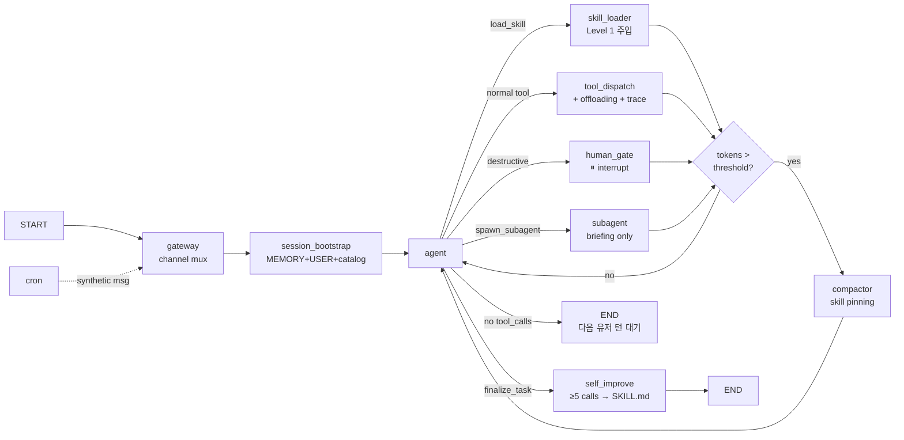

# Agent Harness 패턴을 LangGraph로 구현하기

OpenClaw / Hermes Agent 계열 하네스의 작동 원리를 파악하고, LangGraph의 노드·엣지 모델로 재구성하며, 흔한 오구현을 교정하는 가이드.

---

## 1. 사전 조사: OpenClaw와 Hermes Agent

두 프로젝트 모두 **로컬-퍼스트 메신저 게이트웨이 + Skills 루프** 계열의 에이전트 하네스다. 단일 루프 ReAct나 외곽 계획 루프를 가진 Plan-and-Execute와 다른 축은 "도구와 절차를 런타임에 스스로 조립·학습"하는 것이다.

### OpenClaw (Peter Steinberger, 2026-01 "Moltbot"에서 개명)

- 로컬 실행 봇이 Claude/DeepSeek/OpenAI 같은 외부 LLM과 붙어 에이전틱 워크플로우 인터페이스 역할을 한다.
- WhatsApp/Telegram/Slack/Discord/Feishu/WeCom을 단일 Gateway로 통합. 세션·채널·도구·이벤트를 관리한다.
- Skills는 `SKILL.md`(메타데이터 + 도구 사용 지시)를 담은 디렉터리. bundled → global → workspace 순으로 우선순위가 적용되며 workspace가 최우선.
- 에이전트는 고유 ID·도구·워크스페이스를 가지며 cron + 30분 주기 heartbeat로 구동.
- `SOUL.md`(정체성/규칙) 같은 마크다운 "두뇌 파일"을 workspace에 둔다.

### Hermes Agent (Nous Research, 2026-02-26 릴리스)

- 명시적으로 OpenClaw 후속을 지향한다. `hermes claw migrate`로 설정/메모리/Skills/API 키를 자동 이전.
- 3-티어 구조(UI → 핵심 에이전트 로직 → 실행 백엔드). Skills는 `~/.hermes/skills/`에 저장. `MEMORY.md`/`USER.md`는 장기 사실, 세션은 SQLite SessionDB.
- Progressive disclosure: Level 0에는 스킬 이름+설명만 약 3K 토큰 로드. 필요 시 본문 전체 로드(Level 1).
- `MEMORY.md`(2200자), `USER.md`(1375자)는 캐릭터 리밋이 있는 **frozen snapshot**으로 세션 시작 시 system prompt에 주입. 이후 에이전트가 memory tool(add/replace/remove)로 스스로 관리.
- 복잡 태스크(5+ tool calls) 완료 후 에이전트가 자율적으로 `SKILL.md`(절차/함정/검증 단계)를 작성. 실행 중 더 나은 방식을 발견하면 문서를 스스로 갱신한다.

### 공통 작동 원리

| # | 패턴 | 역할 |
|---|---|---|
| 1 | Gateway 멀티플렉싱 | 여러 채널 → 단일 agent loop. 채널 바인딩으로 라우팅 |
| 2 | Frozen snapshot memory | 세션 시작 시 MEMORY/USER.md를 system prompt에 주입. 이후는 tool로 CRUD |
| 3 | Skills progressive disclosure | 카탈로그(이름+설명)만 상시 로드, 본문은 on-demand |
| 4 | Self-improvement loop | 복잡 태스크 종료 후 성공 경로를 SKILL.md로 증류 |
| 5 | Subagent 위임 | 병렬 워크스트림을 별도 컨텍스트로 분리 |
| 6 | Cron/스케줄러 | 사용자 입력 없이 에이전트 loop 트리거 |

이 패턴이 ReAct / Plan-Execute와 결정적으로 다른 지점은 **#3과 #4** — 런타임 학습이다.

---

## 2. LangGraph PoC

### State 정의

```python
from typing import TypedDict, Annotated, Literal, Optional
from langgraph.graph.message import add_messages
import operator

class HarnessState(TypedDict):
    messages: Annotated[list, add_messages]
    channel: Literal["cli", "telegram", "slack", "cron"]

    memory_snapshot: str          # 세션 시작 시점의 MEMORY + USER
    skills_catalog: dict          # {name: description}  (Level 0)
    loaded_skills: dict           # {name: full_body}     (Level 1, 필요분만)
    skill_last_used: dict         # {name: turn_number}   (eviction 판단용)

    tool_call_count: int          # self-improvement 트리거
    task_trace: Annotated[list, operator.add]   # 성공 궤적
    todos: list[dict]             # 구조화 상태 — messages 밖으로
    scratchpad: dict              # 중간 발견, 가설

    pending_approval: Optional[dict]   # destructive tool gate
    turn: int
```

### 핵심 노드

```python
from pathlib import Path
from langchain_core.messages import (
    SystemMessage, AIMessage, ToolMessage, HumanMessage, RemoveMessage,
)
import json

SKILLS_DIR = Path.home() / ".hermes" / "skills"
MEMORY_DIR = Path.home() / ".hermes" / "memories"
CACHE_DIR  = Path.home() / ".hermes" / "cache"   # 영속 오프로드 경로
SKILL_DISTILL_THRESHOLD = 5
COMPACT_THRESHOLD = 80_000   # 토큰
DESTRUCTIVE = {"bash_rm", "send_email", "charge_card"}


def gateway(state: HarnessState) -> dict:
    """채널별 정규화. mention 필터, 권한 체크."""
    return {}


def session_bootstrap(state: HarnessState) -> dict:
    """불변 system prompt 구성. 세션 동안 바이트 단위로 고정."""
    memory = (MEMORY_DIR / "MEMORY.md").read_text()[:2200]
    user   = (MEMORY_DIR / "USER.md").read_text()[:1375]
    catalog = {
        p.parent.name: _extract_description(p)
        for p in SKILLS_DIR.glob("*/SKILL.md")
    }
    system = SystemMessage(content=(
        f"<memory>\n{memory}\n</memory>\n"
        f"<user>\n{user}\n</user>\n"
        f"<skills_catalog>\n{json.dumps(catalog)}\n</skills_catalog>"
    ))
    return {
        "messages": [system],
        "memory_snapshot": memory + user,
        "skills_catalog": catalog,
        "loaded_skills": {}, "skill_last_used": {},
        "tool_call_count": 0, "turn": 0,
    }


def agent(state: HarnessState) -> dict:
    response = llm_with_tools.invoke(state["messages"])
    return {"messages": [response], "turn": state["turn"] + 1}


def skill_loader(state: HarnessState) -> dict:
    """Level 1 — 본문을 system이 아니라 ToolMessage로 주입."""
    last = state["messages"][-1]
    name = last.tool_calls[0]["args"]["name"]
    body = state["loaded_skills"].get(name) or \
           (SKILLS_DIR / name / "SKILL.md").read_text()
    tool_msg = ToolMessage(
        content=f"<skill:{name}>\n{body}\n</skill>",
        tool_call_id=last.tool_calls[0]["id"],
    )
    return {
        "messages": [tool_msg],
        "loaded_skills": {**state["loaded_skills"], name: body},
        "skill_last_used": {**state["skill_last_used"], name: state["turn"]},
    }


def tool_dispatch(state: HarnessState) -> dict:
    """일반 도구 실행 + result offloading + 증류용 trace 기록."""
    last_ai = state["messages"][-1]
    call = last_ai.tool_calls[0]
    result = execute_tool(call)
    if len(result.content) > 2000:
        CACHE_DIR.mkdir(parents=True, exist_ok=True)
        path = CACHE_DIR / f"out_{_uuid()}.txt"
        path.write_text(result.content)
        content = (
            f"<result path='{path}' bytes={len(result.content)}>\n"
            f"{result.content[:500]}…(truncated, use view tool)\n</result>"
        )
        result = ToolMessage(content=content, tool_call_id=result.tool_call_id)

    # self_improve 증류용 3-tuple. 결과만 쌓으면 '왜 그 도구를 그 인자로
    # 골랐는지'가 증발한다. ReAct의 (Thought, Action, Observation).
    trace_entry = {
        "reasoning":   last_ai.content,          # LLM의 사고 과정
        "tool":        call["name"],
        "args":        call["args"],             # 파라미터 선택
        "observation": result.content[:500],     # 결과 요약
    }
    return {
        "messages": [result],
        "tool_call_count": state["tool_call_count"] + 1,
        "task_trace": [trace_entry],
    }


def human_gate(state: HarnessState) -> dict:
    """파괴적 도구 앞 interrupt. interrupt_before로 지정."""
    return {"pending_approval": state["messages"][-1].tool_calls[0]}


def subagent(state: HarnessState) -> dict:
    """RPC 방식 — 부모 컨텍스트 승계 없음. briefing만 명시 전달.

    spawn_subagent 도구 스키마:
      task:        str   (필수) 자식이 해결할 과제
      context:     str   (선택) 부모가 선별한 관련 맥락만 — 이력 전체 X
      constraints: str   (선택) 워크스페이스·허용 도구·마감 등 제약
    """
    call = state["messages"][-1].tool_calls[0]
    args = call["args"]
    briefing = (
        f"<task>\n{args['task']}\n</task>\n"
        f"<relevant_context>\n{args.get('context', '')}\n</relevant_context>\n"
        f"<constraints>\n{args.get('constraints', '')}\n</constraints>"
    )
    sub_state = {
        "messages": [HumanMessage(content=briefing)],
        "skills_catalog": state["skills_catalog"],       # 읽기 전용 참조
        "memory_snapshot": state["memory_snapshot"],     # 읽기 전용 참조
        "loaded_skills": {}, "skill_last_used": {},
        "tool_call_count": 0, "task_trace": [], "todos": [],
        "scratchpad": {}, "channel": "subagent",
        "pending_approval": None, "turn": 0,
    }
    result = compiled_graph.invoke(sub_state,
                                   config={"recursion_limit": 30})
    summary = summarize(result["messages"])   # 50K → ~200 tokens
    return {"messages": [ToolMessage(content=summary,
                                     tool_call_id=call["id"])]}


def _is_skill_msg(msg) -> bool:
    return (isinstance(msg, ToolMessage)
            and isinstance(msg.content, str)
            and msg.content.startswith("<skill:"))


def compactor(state: HarnessState) -> dict:
    """사후 축약 — 토큰 예산 초과 시만 동작.

    주의 1 (skill pinning): skill ToolMessage를 무차별 삭제하면
      loaded_skills state에는 남아있는데 LLM이 보는 prompt에서는
      본문이 증발해 할루시네이션 유발. 삭제 대상에서 제외한다.
    주의 2 (메시지 역할): Anthropic Messages API는 중간 system role을
      허용하지 않는다. 요약은 HumanMessage로 감싸 외부 컨텍스트임을 명시.
    """
    if count_tokens(state["messages"]) < COMPACT_THRESHOLD:
        return {}

    # 보호할 메시지: 최근 8개(진행 중 맥락) + 모든 skill ToolMessage
    tail_ids  = {m.id for m in state["messages"][-8:]}
    skill_ids = {m.id for m in state["messages"] if _is_skill_msg(m)}
    protected = tail_ids | skill_ids

    to_remove = [m for m in state["messages"] if m.id not in protected]
    if not to_remove:
        return {}

    summary = llm.invoke([
        SystemMessage(content="결정/사실/미완료 작업만 요약."),
        *to_remove,
    ]).content
    return {"messages":
        [RemoveMessage(id=m.id) for m in to_remove] +
        [HumanMessage(content=
            f"<prior_conversation_summary>\n{summary}\n"
            f"</prior_conversation_summary>\n"
            f"(위는 자동 축약된 이전 대화다. 계속 진행하라.)"
        )]
    }


def self_improve(state: HarnessState) -> dict:
    """명시적 finalize_task 호출 시에만 진입. 5+ tool calls 성공 궤적을
    SKILL.md로 증류. trace는 (reasoning, action, observation) 3-tuple."""
    if state["tool_call_count"] < SKILL_DISTILL_THRESHOLD:
        return {}
    trace_text = "\n\n".join(
        f"## Step {i+1}\n"
        f"**Reasoning:** {t['reasoning']}\n"
        f"**Tool:** `{t['tool']}({t['args']})`\n"
        f"**Observation:** {t['observation']}"
        for i, t in enumerate(state["task_trace"])
    )
    skill_md = llm.invoke([
        SystemMessage(content="다음 성공 궤적을 재사용 가능한 SKILL.md로 "
                              "증류하라. 절차/함정/검증 단계를 포함하라."),
        HumanMessage(content=trace_text),
    ]).content
    name = _slugify(skill_md.splitlines()[0])
    (SKILLS_DIR / name).mkdir(exist_ok=True)
    (SKILLS_DIR / name / "SKILL.md").write_text(skill_md)
    return {}
```

### 라우팅과 그래프 조립

```python
from langgraph.graph import StateGraph, START, END

def route_after_agent(state: HarnessState) -> str:
    last = state["messages"][-1]

    # tool_calls 없음 = 유저에게 답변할 준비가 된 것.
    # END로 가는 건 '세션 종료'가 아니라 '이번 invoke 종료 → 다음 유저 턴 대기'.
    if not getattr(last, "tool_calls", None):
        return END

    call = last.tool_calls[0]
    # 에이전트가 명시적으로 '태스크 완료'를 선언할 때만 증류 검토
    if call["name"] == "finalize_task":  return "self_improve"
    if call["name"] == "load_skill":     return "skill_loader"
    if call["name"] == "spawn_subagent": return "subagent"
    if call["name"] in DESTRUCTIVE:      return "human_gate"
    return "tool_dispatch"


def route_after_tool(state: HarnessState) -> str:
    """모든 tool 종료 후 compaction 필요 여부 체크."""
    if count_tokens(state["messages"]) >= COMPACT_THRESHOLD:
        return "compactor"
    return "agent"


g = StateGraph(HarnessState)
for name, fn in [
    ("gateway", gateway), ("session_bootstrap", session_bootstrap),
    ("agent", agent), ("skill_loader", skill_loader),
    ("tool_dispatch", tool_dispatch), ("human_gate", human_gate),
    ("subagent", subagent), ("compactor", compactor),
    ("self_improve", self_improve),
]:
    g.add_node(name, fn)

g.add_edge(START, "gateway")
g.add_edge("gateway", "session_bootstrap")
g.add_edge("session_bootstrap", "agent")

g.add_conditional_edges("agent", route_after_agent, {
    "skill_loader": "skill_loader",
    "tool_dispatch": "tool_dispatch",
    "human_gate": "human_gate",
    "subagent": "subagent",
    "self_improve": "self_improve",
    END: END,     # tool_calls 없을 때 — 일반 응답, 다음 유저 턴 대기
})

# 모든 tool 출구는 compactor 체크를 거쳐 agent로
for n in ["skill_loader", "tool_dispatch", "human_gate", "subagent"]:
    g.add_conditional_edges(n, route_after_tool,
                            {"compactor": "compactor", "agent": "agent"})
g.add_edge("compactor", "agent")
g.add_edge("self_improve", END)

compiled_graph = g.compile(
    interrupt_before=["human_gate"],
    checkpointer=...,    # SQLite 권장
)
```

### 그래프 다이어그램



---

## 3. 흔한 오구현과 교정

이 섹션은 PoC 설계 중 실제로 발생했던 오개념의 교정이다.

### 3-1. Subagent는 fork가 아니라 isolated spawn

**잘못된 구현**:

```python
# ❌ 부모 state deepcopy — fork면 subagent 쓰는 의미가 없다
sub_state = deepcopy(parent_state)
```

부모 컨텍스트를 자식이 이어받으면 "컨텍스트 격리"라는 존재 이유가 사라진다. 자식은 부모보다 더 긴 컨텍스트로 시작하는 꼴.

**올바른 구현**: RPC 모델에 가깝다.

- 부모는 **task description 문자열만** 전달한다 (messages 이력 X)
- 자식은 **빈 messages**로 시작해 탐색/실행
- 자식이 쌓은 수만 토큰은 자식 안에서 폐기
- **요약 1개**만 부모에게 ToolMessage로 반환

이러면 부모에는 `spawn_subagent(task=...)` 호출과 `ToolMessage(summary)` 두 건만 추가된다. 핵심은 **탐색형 작업을 자식에 몰아넣어 부모를 lean하게 유지**하는 것이다.

### 3-2. Subagent는 예방책이지 치료제가 아니다

Subagent는 **"이 작업을 부모 컨텍스트에 쌓으면 안 되겠다"**는 판단 하에 사전 격리하는 도구다. 이미 부모 컨텍스트가 커진 상태에서 subagent를 호출해봐야 부모는 그대로다. 이 상황은 compaction의 영역.

| 증상 | 기법 | 타이밍 |
|---|---|---|
| "앞으로 부모 컨텍스트가 터질 것" | subagent | 사전 격리 |
| "지금 부모 컨텍스트가 터지고 있다" | compactor | 사후 축약 |
| "tool 결과 하나가 거대" | offloading | 진입 시점 |
| "상태가 messages에 산재" | structured state | 상시 |

### 3-3. 설계 검증에서 발견된 결함과 교정

초기 PoC 설계를 비판적으로 리뷰하면서 드러난 추가 결함들이다. LangGraph의 실행 모델과 LLM API 스펙을 함께 고려할 때 **실제로 오작동하거나 외부 API가 거부하는** 지점이므로, 위 흐름과 별개로 명시해 둔다.

**(a) compactor ↔ skill 증발 충돌**

단순한 `messages[:-8]` 슬라이싱으로 과거를 삭제하면, 초기에 `load_skill`로 주입해둔 `<skill:...>` ToolMessage가 함께 증발한다. 하지만 `loaded_skills` state 딕셔너리에는 "이미 로드함"으로 남아있어 재로드가 트리거되지 않는다. 결과는 **지침 없는 상태로 skill 관련 작업 수행 → 할루시네이션**. 교정: compactor가 skill ToolMessage를 **pinning**(삭제 제외)해야 한다. 위 코드의 `_is_skill_msg` 필터가 이 역할을 한다.

**(b) Anthropic API의 중간 SystemMessage 거부**

compactor가 요약본을 `SystemMessage(content="<compacted>...")`로 중간에 삽입하는 설계는 Anthropic Messages API 스펙을 위반한다. `system`은 top-level 파라미터이고 `messages` 배열에는 `user`/`assistant` 역할만 허용된다. 어댑터(LangChain `ChatAnthropic` 등)가 관대하게 처리할 수도, 거부할 수도 있다 — 어느 쪽이든 안전하지 않다. 교정: 요약본은 `HumanMessage(<prior_conversation_summary>...)`로 감싸 외부 주입 맥락임을 명시한다. `AIMessage`로 감싸는 대안은 LLM이 "내가 과거에 그렇게 말했다"고 혼동할 위험이 있어 피한다.

**(c) self_improve가 일반 대화를 중단시키는 문제**

초기 라우팅은 "tool_calls 없으면 self_improve로" 였다. 이 조건은 **도구를 호출하지 않는 모든 턴**(단순 질문·인사·되물음 등)에서 self_improve를 실행시킨다. 매 턴 증류 LLM이 도는 낭비가 발생하고, 짧은 대화에서도 의미 없는 SKILL.md 생성이 시도된다. 교정: 에이전트가 `finalize_task` 도구를 **명시적으로 호출할 때만** self_improve로 가고, 일반 응답은 그냥 `END`로 흘려보낸다. LangGraph에서 `END`는 "세션 종료"가 아니라 "이번 invoke 종료, 다음 유저 메시지까지 대기"다.

**(d) task_trace의 증류 데이터 부족**

`result.content[:200]`만 누적하면 "어떤 결과가 나왔다"만 남고 "**왜 그 도구를 왜 그 인자로 선택했는지**"가 증발한다. 성공 궤적에서 재사용 가능한 **절차와 함정**을 뽑아내려면 의사결정 맥락이 있어야 한다. 교정: trace는 `{reasoning, tool, args, observation}`의 4-튜플(ReAct의 Thought/Action/Observation 대응)로 기록한다.

**(e) /tmp offloading의 휘발성**

`/tmp/out_*.txt`는 컨테이너 재시작·서버리스 워커 이동 시 소실된다. LangGraph Cloud처럼 턴 간에 다른 워커가 요청을 이어받는 환경에서는 포인터만 있고 파일이 없는 상태가 발생한다. 교정: 로컬-퍼스트 하네스면 `~/.hermes/cache/` 같은 영속 경로, 분산/프로덕션이면 S3·Blob storage URI를 반환한다.

**(f) subagent briefing 스키마 명시화**

자식에게 `task` 문자열 하나만 넘기면 부모만 아는 제약·워크스페이스·최근 결정을 모르므로 엉뚱한 방향으로 간다. 반대로 부모 컨텍스트 전체를 요약해 넘기면 격리의 의미가 사라진다(자식이 "요약된 부모 컨텍스트 + 자신의 탐색"으로 비대해짐). 균형점은 **도구 스키마 자체에 `context`, `constraints` 필드를 명시**해 부모가 필요한 만큼만 선별해 넘기도록 강제하는 것.

---

## 4. Context Engineering — 빠지면 안 되는 네 가지

### 4-1. Compaction (사후 축약)

토큰 예산 초과 시 오래된 메시지를 LLM 요약으로 축약. Claude Code의 auto-compact가 이것. LangGraph에서는 `RemoveMessage`로 실제 state에서 제거 가능하다. 다만 compaction이 발생하는 시점에는 **prompt cache prefix가 깨진다** — 한 번의 재캐싱 비용을 감수하는 것.

### 4-2. Tool result offloading

긴 tool 결과는 파일로 내보내고 messages에는 포인터만 남긴다.

```
<result path='~/.hermes/cache/out_abc.txt' bytes=52341>
(앞 500자)…(truncated, use view tool)
</result>
```

필요하면 `view(path)`로 재소환, 안 쓰면 자연 소멸. "당장 봐야 할 정보만 context에 둔다"는 원칙의 구현.

> **환경별 경로 선택**: `/tmp`는 컨테이너 재시작·서버리스 워커 이동 시 증발하는 휘발성 경로다. 로컬-퍼스트 하네스라면 `~/.hermes/cache/` 같은 영속 디렉터리, 분산/프로덕션이라면 S3·Blob storage·Document DB의 URI를 반환해야 한다.

### 4-3. Structured state (messages 밖으로)

TODO, 진행 상태, 발견 사항 같은 **작업 뼈대**는 messages에 쌓지 않고 별도 state 필드에 둔다.

```python
class HarnessState(TypedDict):
    ...
    todos: list[dict]      # [{id, status, task}]
    scratchpad: dict       # 중간 발견, 가설
```

매 턴 system prompt 재조립이 아니라, **tool 호출을 통해** 읽고 쓴다. Hermes가 `MEMORY.md`를 2200자로 못박은 것도 같은 원리 — 에이전트는 거기에 쓰고 읽되, 토큰 비용은 상수.

### 4-4. Skill body eviction

오래 쓰지 않은 skill 본문 ToolMessage를 제거하는 것. 단, **기본 전략은 "그냥 두기"**다. ToolMessage도 prefix에 포함되면 다음 턴부터 cache hit 대상이 되므로, 지우는 게 오히려 손해일 수 있다.

명시적 제거가 필요한 경우:

```python
def evict_stale_skills(state):
    last_used = state["skill_last_used"]
    current = state["turn"]
    stale_ids = [
        msg.id for msg in state["messages"]
        if is_skill_msg(msg)
        and current - last_used.get(skill_of(msg), 0) > 10
    ]
    return {"messages": [RemoveMessage(id=i) for i in stale_ids]}
```

이 시점부터 cache prefix가 깨지므로, **큰 skill을 오래 안 쓸 게 확실할 때만** 가치가 있다.

---

## 5. Prompt Caching과 System Prompt 불변성

### 핵심 원칙

**System prompt는 세션 내내 바이트 단위로 동일해야 한다.**

Anthropic/OpenAI의 prompt cache는 prefix 일치로 작동한다. system이 매 턴 변하면 매번 cache miss → 비용이 수 배, 레이턴시도 수 배. skill body를 "system prompt 상단에 끼워넣었다 뺐다" 하는 것은 **최악의 구현**이다.

### 올바른 배치

```
┌─────────────────────────────────────┐
│ [SYSTEM] 불변 — 세션 내내 고정        │  ← cache hit
│  · 에이전트 정체성                    │
│  · 도구 정의                         │
│  · MEMORY.md / USER.md snapshot      │
│  · skills_catalog (이름+설명만)        │
├─────────────────────────────────────┤
│ [MESSAGES] 가변 — append-only         │
│  HumanMessage: "..."                  │
│  AIMessage(tool_calls=load_skill)     │
│  ToolMessage: <skill:git>본문</...>   │  ← skill 본문은 "여기"
│  AIMessage: ...                       │
│  ToolMessage: ...                     │
└─────────────────────────────────────┘
```

"로드"의 정의: LLM이 `load_skill(name="git")` 호출 → `ToolMessage`로 본문 반환. 이걸로 끝. **system prompt는 건드리지 않는다.**

### 체크리스트

- ✅ system prompt는 세션 내내 바이트 단위로 동일
- ✅ `skills_catalog`(Level 0)는 system에 박아놓고 그대로 둠
- ✅ skill body(Level 1)는 ToolMessage로 들어오고, 기본은 유지
- ✅ `MEMORY.md` **파일**은 도구 실행 즉시 갱신됨 (디스크 쓰기). `ToolMessage` 반환을 통해 LLM이 이번 세션에서도 즉시 인지·활용 가능. 고정되는 건 system prompt에 박힌 **snapshot의 위치**뿐, **지식의 가용 시점이 아니다**.
- ❌ skill 로드마다 system 재조립 → cache 파괴
- ❌ 턴마다 "관련 있어 보이는 skill"을 system 상단에 동적 주입 → 동일한 실수
- ❌ compactor가 요약본을 중간 `SystemMessage`로 삽입 → Anthropic API가 거부. `HumanMessage(<prior_summary>...)`로 감싸야 안전

### Progressive disclosure의 진짜 의미

"동적 로딩"의 동적 부분은 **messages 쪽**이고, system prompt는 세션 동안 얼어 있다. Progressive disclosure는 system을 바꾸는 것이 아니라, **LLM이 스스로 tool call로 필요한 본문을 messages에 끌어오게 만드는 것** — prompt caching을 깨지 않으면서 "필요할 때만 보인다"를 구현하는 유일한 방법이다.

---

## 6. 정리

### 본질적 설계 포인트

Hermes/OpenClaw의 진짜 설계 포인트는 "루프 모양"이 아니라 **`system prompt에 무엇을 언제 넣느냐`** 이다. LangGraph로 옮길 때는 노드 수를 늘리는 게 아니라:

1. `session_bootstrap`(정적 주입, 세션당 1회)과 `skill_loader`(동적 주입, messages에)를 **엄격히 분리**
2. `self_improve`로 **state → 파일시스템** 쓰기 루프를 닫기 (단, **`finalize_task` 명시 호출 시만** — 일반 응답은 `END`로)
3. 모든 tool 출구에 **compactor 체크**를 걸어 토큰 예산 관리 (skill pinning 필수)
4. subagent는 **명시적 briefing 스키마**(`task` + `context` + `constraints`)로 부모 이력 자동 승계 금지

나머지(ReAct / Plan-Execute)는 이 뼈대 위에 얹는 변주일 뿐이다.

### 핵심 원칙 한 줄 요약

- **messages 배열은 "다음 턴에 LLM이 실제로 봐야 할 것"만 담는다.** 나머지는 전부 state 필드 / 파일시스템 / subagent로 외재화.
- **system prompt는 세션 동안 얼어 있다.** 동적인 것은 모두 messages에서 일어난다.
- **subagent는 fork가 아니라 RPC다.** 부모 컨텍스트를 승계하지 않는다.
- **progressive disclosure는 양방향이어야** 하지만, 기본값은 "로드는 적극적으로, 언로드는 보수적으로"다 (cache prefix 보호).
